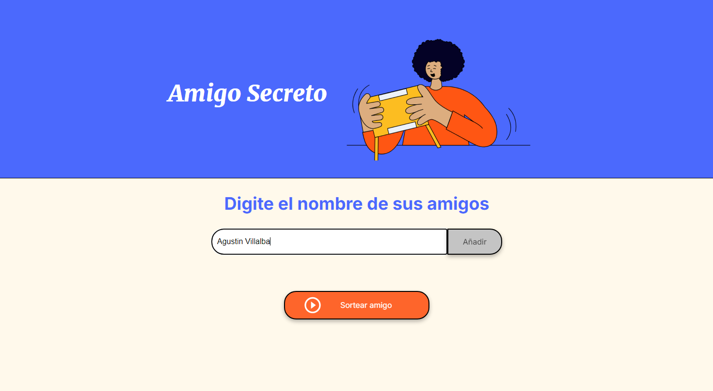
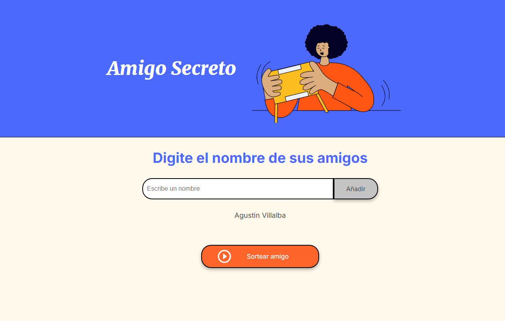
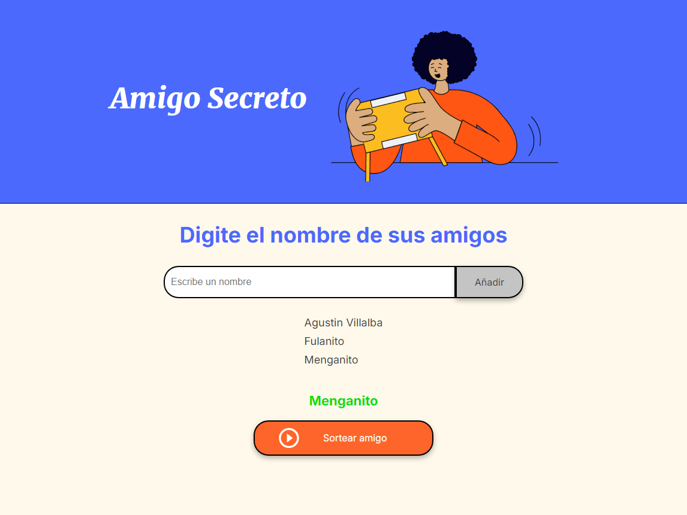

<!-- Improved compatibility of back to top link: See: https://github.com/othneildrew/Best-README-Template/pull/73 -->
<a id="readme-top"></a>
<!--
*** Thanks for checking out the Best-README-Template. If you have a suggestion
*** that would make this better, please fork the repo and create a pull request
*** or simply open an issue with the tag "enhancement".
*** Don't forget to give the project a star!
*** Thanks again! Now go create something AMAZING! :D
-->


<!-- PROJECT SHIELDS -->
<!--
*** I'm using markdown "reference style" links for readability.
*** Reference links are enclosed in brackets [ ] instead of parentheses ( ).
*** See the bottom of this document for the declaration of the reference variables
*** for contributors-url, forks-url, etc. This is an optional, concise syntax you may use.
*** https://www.markdownguide.org/basic-syntax/#reference-style-links
-->


<!-- PROJECT LOGO -->
<br />
<div align="center">
  <a href="https://github.com/github_username/repo_name">
    
  </a>

<h3 align="center">Amigo Secreto</h3>

  <p align="center">
    Primer Challenge Alura G8
    <br />
    <br />
    <br />
    <a href="https://agustinv16.github.io/Amigo-Secreto-Project/">View Demo</a>
  </p>
</div>


<!-- TABLE OF CONTENTS -->
<details>
  <summary>Table of Contents</summary>
  <ol>
    <li>
      <a href="#about-the-project">About The Project</a>
      
      <ul>
        <li><a href="#built-with">Built With</a></li>
      </ul>
    </li>
    <li>
      <a href="#getting-started">Getting Started</a>
      <ul>
        <li><a href="#prerequisites"></a></li>
        <li><a href="#installation">Installation</a></li>
        <li><a href="#functionalities"></a></li>
      </ul>
    </li>
    <li><a href="#acknowledgments">Acknowledgments</a></li>
  </ol>
</details>


<!-- ABOUT THE PROJECT -->
## About The Project


This project was made to complete the path "Practicando Lógica de programación: Challenge Amigo Secreto" of the course "Principiante en Programación G8 - ONE" from Alura LATAM.

<p align="right">(<a href="#readme-top">back to top</a>)</p>


### Built With

* JavaScript [](https://skillicons.dev)
* CSS 3 [](https://skillicons.dev)
* HTML 5 [](https://skillicons.dev)

<p align="right">(<a href="#readme-top">back to top</a>)</p>


<!-- GETTING STARTED -->
## Getting Started

To run this project you only need to clone it locally

### Prerequisites 

If you are using VSCode to run this project locally you may want to have Live Server

* Live Server Extension

  1. Open Extensions Panel
    * Open Visual Studio Code.
    * In the Activity Bar on the left side, click on the Extensions icon   
      (it looks like a square with four squares inside, located on the bottom of the sidebar).
    * Alternatively, you can use the shortcut Ctrl+Shift+X (Windows/Linux)or Cmd+Shift+X (Mac).
  
    

  2. Search for Live Server
    * In the Extensions search box, type “Live Server”.
    * Look for the extension titled “Live Server” by Ritwick Dey (this is  the most popular and widely used extension).
    * Click on Install to install the Live Server extension.

    

  3. Launch Live Server
    * Open the HTML file you want to preview in the browser.
    * At the bottom-right corner of the VS Code window, you will see a Go Live button. Click on it to start the Live Server.
    * Alternatively, you can right-click on your HTML file and select “Open with Live Server” from the context menu.

    

### Installation

1. Clone the repo
   ```sh
   git clone https://github.com/AgustinV16/Amigo-Secreto-Project.git
   ```
2. Change git remote url to avoid accidental pushes to base project
   ```sh
   git remote set-url origin github_username/repo_name
   git remote -v # confirm the changes
   ```

### Functionalities 

- `Functionality 1`: A button that adds friends to a list and then clears the input field

  
  

- `Functionality 2`: A button that chooses a random friend of the list to be the "Amigo Secreto"
  

<p align="right">(<a href="#readme-top">back to top</a>)</p>


<!-- ACKNOWLEDGMENTS -->
## Acknowledgments

* [GitHub Pages](https://pages.github.com)
* [Stack Overflow](https://stackoverflow.com)
* [Alura Latam](https://app.aluracursos.com)

<p align="right">(<a href="#readme-top">back to top</a>)</p>
