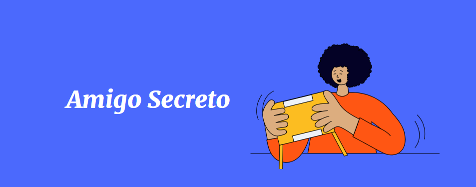

<!-- Improved compatibility of back to top link: See: https://github.com/othneildrew/Best-README-Template/pull/73 -->
<a id="readme-top"></a>
<!--
*** Thanks for checking out the Best-README-Template. If you have a suggestion
*** that would make this better, please fork the repo and create a pull request
*** or simply open an issue with the tag "enhancement".
*** Don't forget to give the project a star!
*** Thanks again! Now go create something AMAZING! :D
-->


<!-- PROJECT SHIELDS -->
<!--
*** I'm using markdown "reference style" links for readability.
*** Reference links are enclosed in brackets [ ] instead of parentheses ( ).
*** See the bottom of this document for the declaration of the reference variables
*** for contributors-url, forks-url, etc. This is an optional, concise syntax you may use.
*** https://www.markdownguide.org/basic-syntax/#reference-style-links
-->


<!-- PROJECT LOGO -->
<br />
<div align="center">
  <a href="https://github.com/github_username/repo_name">
    
  </a>

<h3 align="center">Amigo Secreto</h3>

  <p align="center">
    Primer Challenge Alura G8
    <br />
    <br />
    <br />
    <a href="https://agustinv16.github.io/Amigo-Secreto-Project/">View Demo</a>
    &middot;
  </p>
</div>


<!-- TABLE OF CONTENTS -->
<details>
  <summary>Table of Contents</summary>
  <ol>
    <li>
      <a href="#about-the-project">About The Project</a>
      
      <ul>
        <li><a href="#built-with">Built With</a></li>
      </ul>
    </li>
    <li>
      <a href="#getting-started">Getting Started</a>
      <ul>
        <li><a href="#installation">Installation</a></li>
      </ul>
    </li>
    <li><a href="#contributing">Contributing</a></li>
    <li><a href="#contact">Contact</a></li>
    <li><a href="#acknowledgments">Acknowledgments</a></li>
  </ol>
</details>


<!-- ABOUT THE PROJECT -->
## About The Project



This project was made to complete the path "Practicando Lógica de programación: Challenge Amigo Secreto" of the course "Principiante en Programación G8 - ONE" from Alura LATAM.

<p align="right">(<a href="#readme-top">back to top</a>)</p>


### Built With

* [JavaScript](https://img.shields.io/badge/JavaScript-F7DF1E?style=flat&logo=javascript&logoColor=black)
* [CSS](https://img.shields.io/badge/CSS-563d7c?&style=flat&logo=css3&logoColor=white)
* [HTML](https://img.shields.io/badge/HTML-e34c26?style=flat&logo=html5&logoColor=white)

<p align="right">(<a href="#readme-top">back to top</a>)</p>


<!-- GETTING STARTED -->
## Getting Started

To run this project you only need to clone it locally

### Installation

1. Clone the repo
   ```sh
   git clone https://github.com/AgustinV16/Amigo-Secreto-Project.git
   ```
2. Change git remote url to avoid accidental pushes to base project
   ```sh
   git remote set-url origin github_username/repo_name
   git remote -v # confirm the changes
   ```

<p align="right">(<a href="#readme-top">back to top</a>)</p>


<!-- ACKNOWLEDGMENTS -->
## Acknowledgments

* [GitHub Pages](https://pages.github.com)
* [Stack Overflow](https://stackoverflow.com)
* [Alura Latam](https://app.aluracursos.com)

<p align="right">(<a href="#readme-top">back to top</a>)</p>
